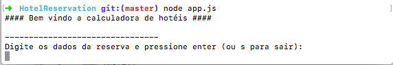

### HotelReservation
Sistema de reserva de hotéis para rede de Miami.

## Funcionalidades:

* Busca de opção de hotel mais barata para reserva.

## Validações:

* Sistema só aceita entrada de busca no formato: <tipo_do_cliente>: <data1>, <data2>, <data3>, …
* Como no exemplo: Regular: 16Mar2009(mon), 17Mar2009(tues), 18Mar2009(wed)

## Linguagem 

* JavaScript

## Execução

### Requisitos
 * Node.js
``npm install``

### Configuração ambiente
 
1. No terminal abra a pasta server dentro da raiz do projeto. E execute:
2. ``npm install`` para instalação dos testes de tdd mocha.

## Para realizar os testes de tdd
1. No terminal abra a pasta server dentro da raiz do projeto. E execute:
2. ``npm test``

## Para rodar o projeto
1. No terminal abra a pasta server dentro da raiz do projeto. E execute:
2. ``node app.js``

 ### Se tudo der certo, ao acessar você deve ver a seguinte tela:
 
